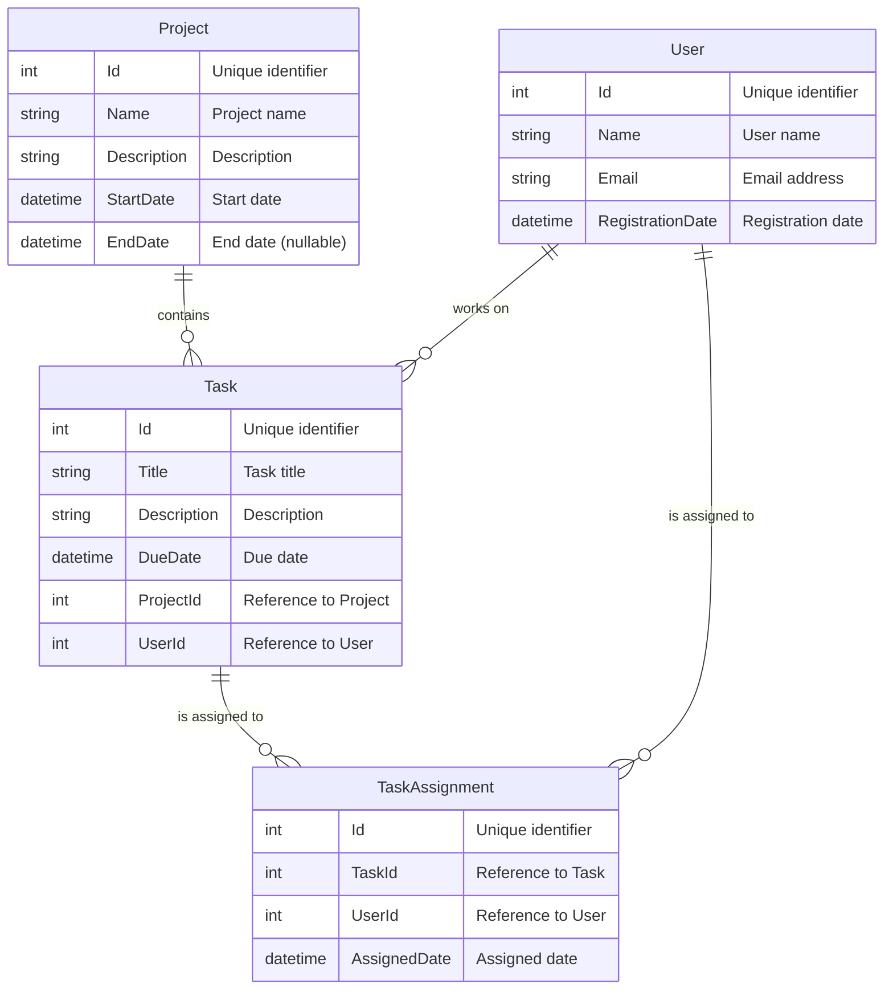
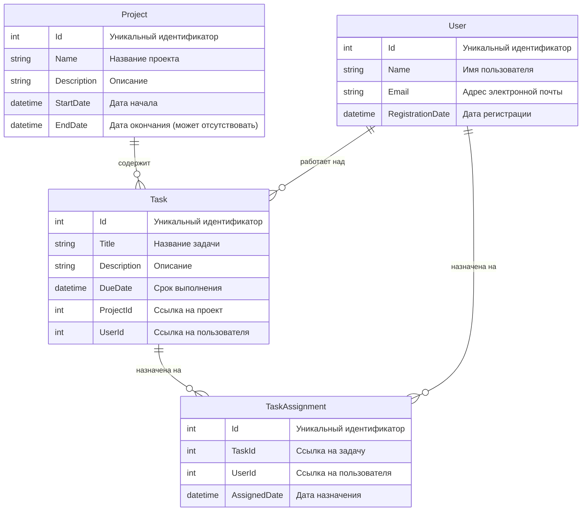

# Task Management System using .NET Core and Entity Framework Core

## Simple Project with LINQ

Integrating LINQ with other technologies (e.g., .NET, Entity Framework). Create a project using all the information and skills you have acquired while learning the LINQ topic.

## Overview

This project involves creating a backend service for a task management system using .NET Core and Entity Framework Core. The system will manage tasks, projects, users, and task assignments through CRUD operations and advanced LINQ queries.

## Objectives

- Implement CRUD operations for each entity.
- Utilize advanced LINQ queries for complex data retrieval.
- Apply best practices in EF Core.
- Develop an understanding of service-oriented architecture in .NET Core.
- Gain experience with data modeling and database management.

## Tools and Technologies

- .NET Core 8
- Entity Framework Core
- PostgreSQL or any compatible database
- Visual Studio or VS Code

## Entities

### Task

- Id (int)
- Title (string)
- Description (string)
- DueDate (DateTime)
- ProjectId (int) [Foreign Key]
- UserId (int) [Foreign Key]

### Project

- Id (int)
- Name (string)
- Description (string)
- StartDate (DateTime)
- EndDate (DateTime?)

### User

- Id (int)
- Name (string)
- Email (string)
- RegistrationDate (DateTime)

### TaskAssignment

- Id (int)
- TaskId (int) [Foreign Key]
- UserId (int) [Foreign Key]
- AssignedDate (DateTime)

### Entities in Mermaid Format

## Services

Each service layer should contain business logic for managing its respective entity and performing advanced LINQ queries.

### TaskService

- **AddTask**: Adds a new task.
- **UpdateTask**: Updates task details.
- **DeleteTask**: Deletes a task.
- **GetTask**: Retrieves task details.
- **GetTasksByProject**: Retrieves all tasks in a specific project.
- **GetTasksByUser**: Retrieves all tasks assigned to a specific user.
- **GetTasksDueSoon**: Retrieves tasks due within the next N days.

### ProjectService

- **AddProject**: Adds a new project.
- **UpdateProject**: Updates project details.
- **DeleteProject**: Deletes a project.
- **GetProject**: Retrieves project details.
- **GetProjectsWithMostTasks**: Retrieves projects with the most tasks.

### UserService

- **AddUser**: Adds a new user.
- **UpdateUser**: Updates user details.
- **DeleteUser**: Deletes a user.
- **GetUser**: Retrieves user details.
- **GetUsersWithMostTasks**: Retrieves users with the most assigned tasks.

### TaskAssignmentService

- **AssignTask**: Assigns a task to a user.
- **UpdateAssignment**: Updates assignment details.
- **DeleteAssignment**: Deletes a task assignment.
- **GetAssignment**: Retrieves assignment details.
- **GetAssignmentsByUser**: Retrieves all task assignments for a specific user.
- **GetAssignmentsByTask**: Retrieves all task assignments for a specific task.

## Requirements

### Database Setup

- Use Entity Framework Core migrations to set up the database schema.
- Seed the database with initial data for testing purposes.

### API Development

- Develop RESTful APIs for each CRUD operation for each entity using ASP.NET Core.
- Utilize controllers and services to handle HTTP requests and responses.

### Exception Handling

- Implement exception handling to manage errors and exceptions gracefully.

### Validation

- Implement data validation mechanisms using data annotations and fluent validation to ensure data integrity and security.

### Documentation

- Document APIs using Swagger/OpenAPI to provide interactive API documentation and client SDK generation.

## Submission Guidelines

- Submit the project in a GitHub repository containing all source code, configuration files, and documentation.
- Include a comprehensive `README.md` file with setup instructions, system overview, and detailed descriptions of each service method.

## Evaluation Criteria

- Evaluate code organization, clarity, and adherence to best practices.
- Assess the correct implementation of CRUD operations and service layers.
- Review effective use of Entity Framework Core features and LINQ queries.
- Evaluate handling of edge cases, error scenarios, and data validation.

##

##

##

# Система управления задачами с использованием .NET Core и Entity Framework Core

## Простой проект с LINQ

### Обзор

Этот проект включает создание серверной службы для системы управления задачами с использованием .NET Core и Entity Framework Core. Система будет управлять задачами, проектами, пользователями и назначениями задач с помощью операций CRUD и расширенных запросов LINQ.

### Цели

- Реализация операций CRUD для каждого объекта.
- Использование расширенных запросов LINQ для сложного поиска данных.
- Применение лучших практик в EF Core.
- Развитие понимания сервис-ориентированной архитектуры в .NET Core.
- Получение опыта моделирования данных и управления базами данных.

### Инструменты и технологии

- .NET Core 8
- Ядро Entity Framework
- PostgreSQL или любая совместимая база данных
- Visual Studio или VS Code

### Сущности

#### Task

- Id (int)
- Title (string)
- Description (string)
- DueDate (DateTime)
- ProjectId (int) [Foreign Key]
- UserId (int) [Foreign Key]

#### Project

- Id (int)
- Name (string)
- Description (string)
- StartDate (DateTime)
- EndDate (DateTime?)

#### User

- Id (int)
- Name (string)
- Email (string)
- RegistrationDate (DateTime)

#### TaskAssignment

- Id (int)
- TaskId (int) [Foreign Key]
- UserId (int) [Foreign Key]
- AssignedDate (DateTime)

### Сущности в формате Mermaid

# Услуги

Каждый уровень обслуживания содержит бизнес-логику для управления соответствующим объектом и выполнения расширенных запросов LINQ.

## TaskService

- **AddTask**: добавляет новую задачу.
- **UpdateTask**: обновляет сведения о задаче.
- **DeleteTask**: удаляет задачу.
- **GetTask**: извлекает сведения о задаче.
- **GetTasksByProject**: извлекает все задачи в рамках определенного проекта.
- **GetTasksByUser**: извлекает все задачи, назначенные конкретному пользователю.
- **GetTasksDueSoon**: извлекает задачи со сроком выполнения в течение следующих N дней.

## ProjectService

- **AddProject**: добавляет новый проект.
- **UpdateProject**: обновляет сведения о проекте.
- **DeleteProject**: удаляет проект.
- **GetProject**: извлекает сведения о проекте.
- **GetProjectsWithMostTasks**: извлекает проекты с наибольшим количеством задач.

## UserService

- **AddUser**: добавляет нового пользователя.
- **UpdateUser**: обновляет сведения о пользователе.
- **DeleteUser**: удаляет пользователя.
- **GetUser**: извлекает сведения о пользователе.
- **GetUsersWithMostTasks**: извлекает пользователей с наибольшим количеством назначенных задач.

## TaskAssignmentService

- **AssignTask**: назначает задачу пользователю.
- **UpdateAssignment**: обновляет сведения о назначении.
- **DeleteAssignment**: удаляет назначение задачи.
- **GetAssignment**: извлекает сведения о назначении.
- **GetAssignmentsByUser**: извлекает все назначения задач для конкретного пользователя.
- **GetAssignmentsByTask**: извлекает все назначения задач для конкретной задачи.

# Требования

## Настройка базы данных

- Используйте миграции Entity Framework Core для настройки схемы базы данных.
- Заполните базу данных начальными данными для целей тестирования.

## Разработка API

- Разрабатывайте RESTful API для каждой операции CRUD для каждого объекта с использованием ASP.NET Core.
- Используйте контроллеры и службы для обработки HTTP-запросов и ответов.

## Обработка исключений

- Реализуйте обработку исключений для корректного управления ошибками и исключениями.

## Валидация

- Реализуйте механизмы проверки данных с использованием аннотаций данных и гибкой валидации для обеспечения целостности данных и безопасности.

## Документация

- Документируйте API с использованием Swagger/OpenAPI для предоставления интерактивной документации по API и генерации клиентских SDK.

# Руководство по отправке

- Отправьте проект в репозиторий GitHub, содержащий весь исходный код, файлы конфигурации и документацию.
- Включите в репозиторий полный файл README.md с инструкциями по настройке, обзором системы и подробным описанием каждого метода службы.

# Критерии оценки

- Оценка организации кода, ясности и соблюдения лучших практик.
- Оценка правильности выполнения операций CRUD и уровней обслуживания.
- Оценка эффективного использования функций Entity Framework Core и запросов LINQ.
- Оценка обработки крайних случаев, сценариев ошибок и проверки данных.
